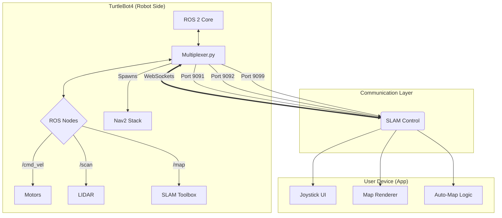

# 🤖 TurtleBot4 Mobile Companion App

[](https://reactnative.dev/)
[](https://expo.dev/)
[](https://docs.ros.org/en/jazzy/)
[](https://www.python.org/)
[](LICENSE)

> **A professional-grade mobile interface for the TurtleBot4, bridging the gap between complex ROS 2 robotics and intuitive mobile user experience.**

## 📋 Table of Contents
- [Overview](#-overview)
- [Key Features](#-key-features)
- [System Architecture](#-system-architecture)
- [Technologies Used](#-technologies-used)
- [Quick Start](#-quick-start)
- [Project Structure](#-project-structure)
- [Performance & Specs](#-performance--specs)
- [Use Cases](#-use-cases)
- [Future Extensions](#-future-extensions)
- [Safety Notice](#-safety-notice)
- [Contributing](#-contributing)
- [Acknowledgments](#-acknowledgments)

---

## 🎯 Overview

This project provides a robust **React Native companion application** for the TurtleBot4, enabling seamless teleoperation, real-time SLAM visualization, and autonomous mapping control. It abstracts the complexity of ROS 2 topics into a user-friendly mobile interface.

### The Problem
Working with headless robots like the TurtleBot4 often requires:
- Tethering to a laptop for visualization (RViz).
- Complex CLI commands to launch SLAM or Navigation stacks.
- Lack of immediate feedback on battery or connection status.
- No easy way to perform quick inspections or mapping runs without a full workstation setup.

### Our Solution
A **hybrid architecture** comprising a high-performance Python bridge running on the robot and a sleek mobile frontend:
1.  **Multiplexes ROS 2 topics** (Odometry, Battery, Map) into efficient WebSocket streams.
2.  **Visualizes Occupancy Grids** by converting them to lightweight imagery on the edge.
3.  **Controls Navigation Stacks** (Nav2) via simple API calls.
4.  **Autonomously Explores** unknown environments with a single tap.

---

## ✨ Key Features

- 🎮 **Dual Control Modes** - Switch seamlessly between **Joystick** (analog precision) and **Button Pad** (discrete steps).
- 🗺️ **Real-Time SLAM** - Live visualization of the robot's map and trajectory using customized `slam_toolbox` integration.
- 🤖 **Autonomous Mapping** - "One-click" frontier exploration that automatically launches SLAM, Nav2, and explorer nodes.
- 🔋 **Live Telemetry** - Instant feedback on Battery State, Joint States, and Connection Quality.
- 💾 **Map Management** - Save, retrieve, and view generated maps directly from the device.
- 📡 **Robust Connectivity** - Auto-reconnecting WebSockets with dedicated channels for Command, Map, and Status.
- 🎨 **Modern UI** - Dark-mode optimized interface built with React Native Reanimated and SVG.

---

## 🏗️ System Architecture

The system uses a client-server architecture where the **Python Multiplexer** acts as a middleware between the raw ROS 2 DDS middleware and the mobile application.

### Communication Flow


### Component Interaction
```
┌─────────────────┐       JSON/Bin    ┌──────────────────┐    rclpy API     ┌─────────────────┐
│  Mobile App     │ ════════════════> │  Multiplexer.py  │ ═══════════════> │   ROS 2 Jazzy   │
│ (React Native)  │   WebSockets      │ (Python Bridge)  │                  │  (TurtleBot4)   │
│                 │                   │                  │                  │                 │
│ • Joystick UI   │                   │ • WebSocket Srv  │                  │ • /cmd_vel      │
│ • Map Canvas    │                   │ • Image Encoding │                  │ • /map          │
│ • State Mgmt    │                   │ • Proc Manager   │                  │ • /battery_state│
└─────────────────┘                   └──────────────────┘                  └─────────────────┘
         ↓                                     ↓                                     ↓
    User Interface                     Middleware Logic                         Hardware
     (Frontend)                       (Edge Processing)                       (Actuation)
```

---

## 🛠️ Technologies Used

### Mobile Application


- **React Native Reanimated:** For 60fps UI transitions.
- **React Native SVG/Canvas:** High-performance map rendering.
- **AsyncStorage:** Local config and preference persistence.

### Robot Backend


- **rclpy:** Python client library for ROS 2.
- **NumPy/Pillow:** Fast array manipulation for map-to-image conversion.
- **Subprocess:** Management of heavy system processes (SLAM, Nav2).

---

## 🚀 Quick Start

### Prerequisites
- **TurtleBot4** running standard ROS 2 Jazzy image.
- **Development PC** with Node.js and Expo CLI.
- **Network:** Robot and Mobile Device must be on the same Wi-Fi network.

### 1. Robot Setup (Backend)
Transfer the `PythonAssists` folder and `mynav2.yaml` to your TurtleBot.

```bash
# On the TurtleBot4
cd ~/turtlebot4_ws
# Install dependencies
pip3 install websockets numpy pillow

# Run the Multiplexer
python3 Multiplexer.py
```
*The bridge will start listening on ports 9091-9099.*

### 2. App Setup (Frontend)
Clone this repository to your development machine.

```bash
# Clone repository
git clone https://github.com/Shuaibu-oluwatunmise/TurtleBot4App.git
cd TurtleBot4App

# Install dependencies
npm install

# Start the Expo development server
npx expo start
```

### 3. Connecting
1. Open the app on your phone (via Expo Go) or Simulator.
2. Enter the **IP Address** of your TurtleBot.
3. Tap **Connect**. You should see the battery status update immediately.

---

## 📁 Project Structure

```
TurtleBot4App/
├── PythonAssists/               # 🧠 Robot-side logic
│   ├── Multiplexer.py          # Main bridge server (ROS 2 <-> WebSocket)
│   └── frontier_explorer.py    # Autonomous exploration logic
│
├── Turtlebot Config/           # ⚙️ Robot configuration
│   └── mynav2.yaml             # Navigation stack parameters
│
├── features/                    # 📱 App Feature Modules
│   ├── Battery/                # Battery monitoring components
│   ├── Landing/                # Main dashboard
│   ├── Map/                    # Mapping & SLAM visualization
│   │   ├── MapScreen.tsx       # Main mapping UI
│   │   └── ViewMapScreen.tsx   # Saved map viewer
│   ├── Teleop/                 # Joystick and Button controls
│   └── IpLogin/                # Connection handling
│
├── components/                  # 🧩 Reusable UI Components
├── assets/                      # 🖼️ Static assets (icons, images)
├── App.tsx                      # Application Entry Point
└── package.json                 # Dependencies and scripts
```

---

## 📊 Performance & Specs

| Metric | Specification | Notes |
|--------|---------------|-------|
| **Control Latency** | < 15ms | LAN optimized WebSocket |
| **Map Update Rate** | 1-5 Hz | Adaptive based on change |
| **Video/Map Stream** | 640x480 @ 10fps | Compressed Grayscale PNG |
| **Supported OS** | iOS & Android | Via Expo |
| **ROS Distribution** | ROS 2 Jazzy | Compatible with Humble |

---

## 🎯 Use Cases

### 1. Remote Inspection
Deploy the robot into a hazardous or inaccessible area. Use the app to drive safely while monitoring the generated map to ensure full coverage, all from a safe distance.

### 2. Education & Demo
Perfect for teaching ROS 2 concepts. Students can visualize how SLAM works in real-time on their phones without needing to understand the complexities of RViz or Linux networking initially.

### 3. Rapid Mapping Needs
Quickly generate a map of a room or floor for future navigation tasks without dragging a laptop cart around with the robot.

---

## 🔮 Future Extensions

- [ ] **Camera Streaming:** Integrate WebRTC or MJPEG stream for live video feed.
- [ ] **Point-and-Click Navigation:** Tap anywhere on the map to send the robot there (WaitAtWaypoint).
- [ ] **Voice Control:** Integrate local voice recognition for commands like "Return Home" or "Explore".
- [ ] **Cloud Sync:** Automatically upload saved maps to a cloud dashboard.

---

## 🔒 Safety Notice

**This app is a remote control tool, not a safety device.**

- **Always** maintain line-of-sight with the robot when operating in Manual Mode.
- **Autonomous Mode** should only be used in enclosed areas free of fragile objects or pets.
- The **Stop** button in the app relies on network connectivity; always be ready to use the physical E-Stop on the robot if available.

---

## 🤝 Contributing

Contributions are what make the open-source community such an amazing place to learn, inspire, and create. Any contributions you make are **greatly appreciated**.

1. Fork the Project
2. Create your Feature Branch (`git checkout -b feature/AmazingFeature`)
3. Commit your Changes (`git commit -m 'Add some AmazingFeature'`)
4. Push to the Branch (`git push origin feature/AmazingFeature`)
5. Open a Pull Request

---

## 👨‍💻 Author

**Oluwatunmise Shuaibu**

- 🔗 GitHub: [@Shuaibu-oluwatunmise](https://github.com/Shuaibu-oluwatunmise)
- 💼 LinkedIn: [Oluwatunmise Shuaibu](https://linkedin.com/in/oluwatunmise-shuaibu-881519257)

---

<div align="center">

**Made with ❤️ for Robotics**

*Star this repo if you found it useful!* ⭐

</div>
